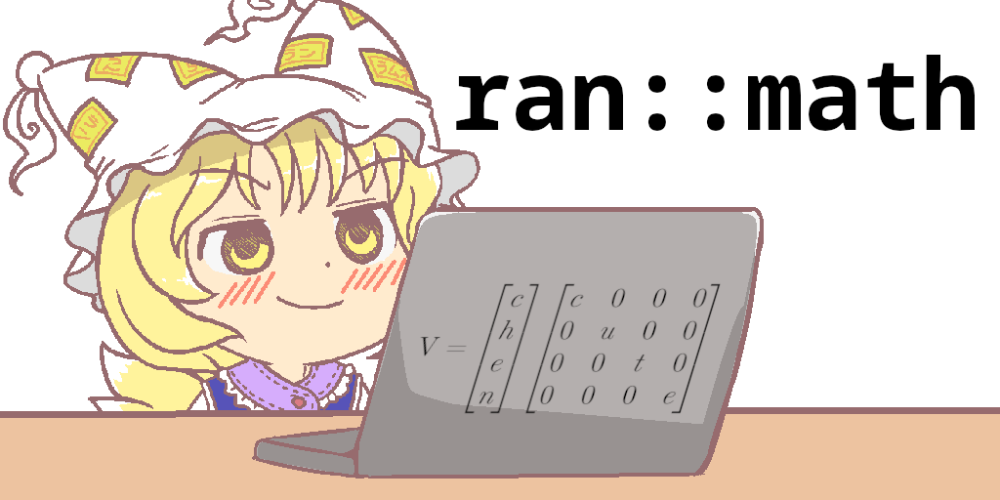

## ran::math


Header only 3D graphics math library for C++20. Optimized to be used with Vulkan & OpenGL.

## Building 
Clone the repo somewhere in your project's library folder.

```sh 
$ cd my_funny_project/
$ mkdir -p lib/
$ git clone https://github.com/nesktf/ranmath.git ./lib/ranmath
```
Then add the library as a subdirectory in your CMakeLists.txt.

```cmake
cmake_minimum_required(VERSION 3.25)
project(my_funny_project CXX)
# ...
add_subdirectory("lib/ranmath")
# ...
set_target_properties(${PROJECT_NAME} PROPERTIES CXX_STANDARD 20)
target_link_libraries(${PROJECT_NAME} ranmath::ranmath)
```

Alternatively, you can generate a single header file either by using the script at
`script/single.py` or by defining the option `RAN_SINGLE` and running `make`. You need
Python 3 installed and available in your PATH.

```sh 
$ cmake -B build -DRAN_SINGLE=1
$ make -C build -j$(nproc)
```

The script generates two header files: `ranmath/ran.hpp` with definitions and `ranmath/forward.hpp`
with declarations. These two are written to `<path/to/build>/include/` by default. You can
just copy these two to your project folder and use them directly.

```sh
$ mkdir -p lib/ranmath/
$ cp build/include/ranmath* lib/ranmath/
```

## Usage
Include either `<ranmath/forward.hpp>` for forward declarations or `<ranmath/ran.hpp>` for the
actual definitions.

The library has a similar API to [GLM](https://github.com/g-truc/glm) with some small
differences to suit my tastes. Matrices are column major just like GLM.

```cpp
#include <ranmath/ran.hpp>

ran::Vec3f32 rotate_y(ran::Vec3f32 vec, ran::f32 angle) {
  const auto mat = ran::rotate(ran::Mat4f32::identity(), angle, ran::Vec3f32(0.f, 1.f, 0.f));
  return vec * mat;
}
```

## TODO
- Add feature list
- Add tests
- Add docs
- Add examples
- Add C++20 module
